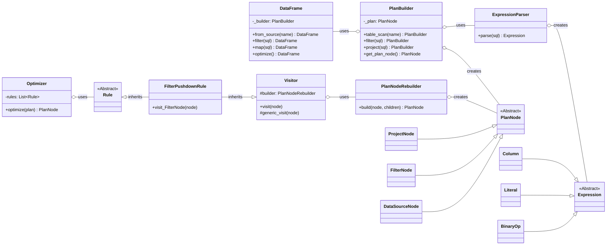

# veloxdf design

## 1. 背景

`veloxdf`是一个轻量级、现代化的 Python DataFrame。其核心目标是构建一个包含核心组件（API、解析器、AST、优化器）的、可扩展的框架。

### 1.1 功能性需求
1. DataFrame API: 提供一个简单、链式调用的 `DataFrame` 接口，支持 `from_source`, `map`, `filter` 等操作。
2. 表达式解析: 实现一个 `ExpressionParser`，能够将类 SQL 的字符串表达式解析为内部的抽象语法树 (AST)，并能区分列、嵌套列、字面量和函数。
3. 抽象语法树 (AST): 设计一套清晰的 AST 节点，用于表示逻辑计划 (`PlanNode`) 和表达式 (`Expression`)。
4. 优化器框架: 创建一个可扩展的、基于规则的优化器 (`Optimizer`)，采用访问者模式 (Visitor Pattern) 遍历并转换 AST，比如`FilterPushdownRule`。

### 1.2 非功能性需求
1. 项目管理与依赖: 使用 `poetry` 进行管理。项目需兼容 Python 3.7，并使用 `sqlglot` (版本 ~20.0) 作为核心解析库。
2. 代码质量与工具:
  - 使用 `pytest` 进行单元测试。
  - 使用 `black` 和 `isort` 进行代码格式化和导入排序，以保证代码风格统一。
  - 使用 `mypy` 进行静态类型检查。

## 2. 设计思想与类图
### 2.1 设计思想

1. `veloxdf`划分为几个独立的层次:
  - API 层 (`DataFrame`): 作为用户交互的唯一入口，提供了一个简洁、易用的流式接口。
  - 构建层 (`PlanBuilder`): 负责将 API 层的调用翻译成具体的逻辑计划树 (`PlanNode` AST)，隐藏了 AST 节点创建和组装的细节。
  - 解析层 (`ExpressionParser`): 负责将用户输入的字符串表达式（如 `"c0 > 10"`）解析成表达式树 (`Expression` AST)。它利用 `sqlglot` 作为底层引擎，并将其输出转换为我们自定义的 AST 结构。
  - 表示层 (`ast.py`): 定义了整个系统的“通用语言”——抽象语法树。
  - 转换层 (`Optimizer`, `PlanNodeRebuilder`): 负责遍历和修改逻辑计划树。
2. 不可变性 (Immutability): 这是保证代码健壮性、可预测性和线程安全的关键。
  - API 不可变: `DataFrame` 的所有转换方法 (`filter`, `map`) 都会返回一个新的 `DataFrame` 实例，而不是修改自身。这使得调试和推理代码行为变得非常简单。
  - 表达式不可变: `Expression` 相关的 AST 节点被设计为 `frozen=True` 的 `dataclass`，从语法层面保证一旦创建便无法修改。
  - 逻辑计划的不可变转换: 虽然 `PlanNode` 节点本身是可变的，但我们的优化器和转换逻辑遵循“不可变约定”。`Optimizer` 在遍历 AST 时，通过 `PlanNodeRebuilder` 创建新的节点来替换旧节点，而不是在原地修改。
3. 关注点分离 (Separation of Concerns): 项目中职责最容易混淆的两个“构建器”被明确分开，各自承担不同的角色。
  - `PlanBuilder` (工厂): 这是一个高层构建器，面向 API。它的职责是从零开始组装一个完整的逻辑计划。它的接口是流式的，非常适合链式调用。
  - `PlanNodeRebuilder` (修理工): 这是一个底层的、专用的工具，面向优化器。它的职责是在一个已有的计划树上，根据新的子节点重建一个父节点。

### 2.2 类图

## 3. 附录：核心类与模块详解
### veloxdf/ast.py
- 核心职责: 定义系统的所有数据结构（AST 节点），是整个框架的“通用语言”。
- 关键类与逻辑:
  - `Node`: 所有节点的抽象基类，提供了通用的 `to_dict` 方法用于序列化，以及 `__repr__` 用于调试。
  - `Expression`: 表达式节点的抽象基类。
    - `Column`, `Literal`, `BinaryOp`, `FunctionCall`, `Alias`: 这些是 `Expression` 的具体子类，使用 `@dataclass(frozen=True)` 定义。`frozen=True` 使得这些对象实例在创建后不可修改，极大地增强了代码的稳定性和可预测性。
  - `PlanNode`: 逻辑计划节点的抽象基类。
    - `DataSourceNode`, `ProjectNode`, `FilterNode`: 这些是 `PlanNode` 的具体子类。它们是可变的 `dataclass`，并在 `__post_init__` 方法中初始化 `children` 属性。这个 `children` 属性为 `Visitor` 模式提供了一个统一的接口来遍历任何类型的 `PlanNode`，而无需关心其具体的子节点字段名（如 `child`）。
### veloxdf/parser.py
- 核心职责: 将用户输入的 SQL 表达式字符串，转换为内部的 `Expression` AST。
- 关键类与逻辑:
  - `ExpressionParser`:
    - `parse(sql_string)`: 这是公共入口方法。它调用 `sqlglot.parse_one` 将字符串解析为 `sqlglot` 的 AST，然后将结果传递给内部的 `_transform` 方法进行转换。
    - `_transform(node)`: 这是解析器的核心。它是一个递归方法，通过一系列 `isinstance` 判断来识别 `sqlglot` 节点类型，并将其映射到我们自定义的 `Expression` 节点。例如，`sqlglot.exp.Binary` 被转换为我们的 `BinaryOp`。这种映射关系使得我们的框架与 `sqlglot` 的内部实现解耦。
  - `_parse_literal_value()`: 一个辅助函数，用于智能地将字符串形式的字面量（如 `"123"`）转换为正确的 Python 类型（`int`, `float` 或 `str`）。
### veloxdf/plan_builder.py
- 核心职责: 提供一个高级的、流式的 API，用于从零开始组装一个逻辑计划。
- 关键类与逻辑:
  - `PlanBuilder`:
    - 流式接口 (Fluent Interface): `table_scan`, `filter`, `project` 等方法都返回一个新的 `PlanBuilder` 实例。这使得 `DataFrame` API 的链式调用 (`df.filter(...).map(...)`) 得以实现。
    - 封装性: 它封装了 `PlanNode` 的创建细节。例如，`filter` 方法内部处理了解析 SQL 字符串和创建 `FilterNode` 的所有工作。用户（即 `DataFrame` 类）无需关心这些细节。
    - 不可变构建: 每个方法都通过创建一个包含新 `PlanNode` 的新 `PlanBuilder` 实例来工作，保证了构建过程的不可变性。
### veloxdf/dataframe.py
- 核心职责: 作为框架的用户接口层，提供一个简洁、易用的 DataFrame API。
- 关键类与逻辑:
  - `DataFrame`:
    - 外观模式 (Facade Pattern): 它本身不包含复杂的逻辑，而是将用户的调用委托给内部的 `_builder` (`PlanBuilder` 的实例)。例如，`df.filter(sql)` 实际上是调用 `self._builder.filter(sql)` 并用返回的新 builder 创建一个新的 `DataFrame`。
    - 不可变性: 由于每个操作都返回一个新的 `DataFrame` 实例，用户可以安全地持有对中间结果的引用，而不用担心它们被意外修改。
    - 与优化器的集成: `optimize()` 方法是连接 API 和优化器的桥梁。它从 `_builder` 获取当前的计划，交给 `Optimizer` 处理，然后用优化后的计划创建一个新的 `DataFrame` 实例。
### veloxdf/optimizer.py
- 核心职责: 定义优化器框架，并实现具体的优化规则来转换逻辑计划。
- 关键类与逻辑:
  - `Visitor`: 实现了访问者设计模式，是树遍历的核心。
    - `visit(node)`: 通过 `getattr` 实现动态分发，将节点交给特定的 `visit_NodeType` 方法处理，如果找不到，则调用 `generic_visit`。
    - `generic_visit(node)`: 负责递归地访问所有子节点，并在任何子节点发生变化时，调用 `PlanNodeRebuilder` 来重建当前节点。
  - `Rule`: 继承自 `Visitor`，是所有优化规则的基类。
  - `FilterPushdownRule`: 一个具体的规则示例。它重写了 `visit_FilterNode` 方法，专门处理 `FilterNode`。当它发现其子节点是 `ProjectNode` 时，就执行下推逻辑，使用 `self.builder`（即 `PlanNodeRebuilder`）来创建新的、交换过顺序的节点。
  - `Optimizer`: 优化器的执行引擎。它持有一系列规则，并按顺序应用它们。
### veloxdf/plan_rebuilder.py
- 核心职责: 在优化器遍历树的过程中，根据一个旧的父节点和一组新的子节点，精确地重建一个新的父节点。
- 关键类与逻辑:
  - `PlanNodeRebuilder`:
    - `build(node, new_children)`: 这是它的核心方法。它根据传入的旧 `node` 的类型，分发到具体的 `build_project` 或 `build_filter` 方法。
    - 精确重建: `build_project` 等方法从旧节点复制非子节点属性（如 `projections`），并使用新的子节点来构造一个全新的、不可变的 `ProjectNode`。
    - 职责单一: 它的存在使得 `Visitor` 的逻辑变得非常纯粹（只负责遍历），而重建的逻辑则被完全封装在这里。这是保持代码清晰和可维护的关键设计决策。